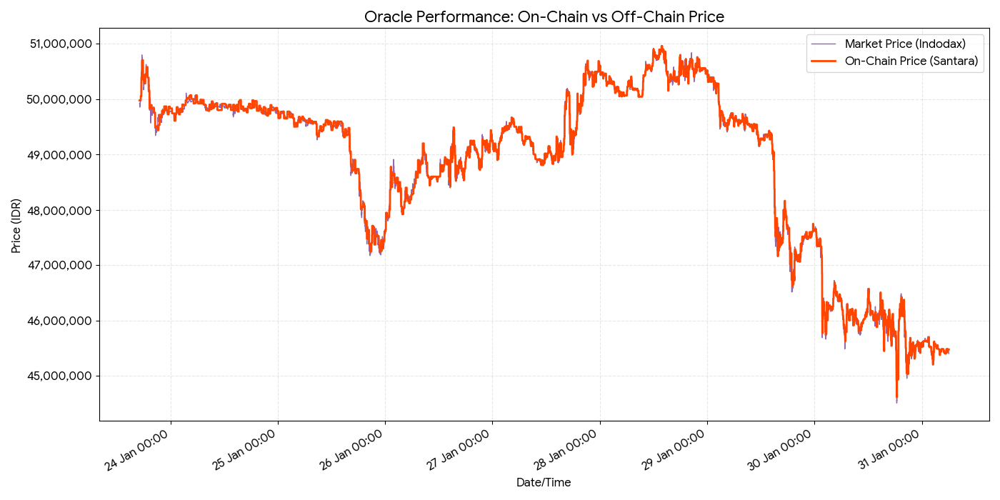
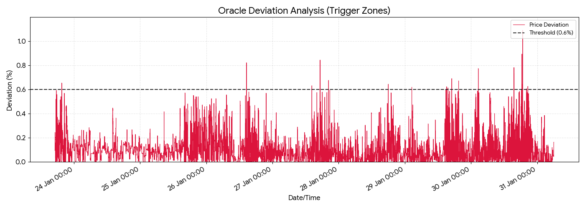

# 🇮🇩 Santara Protocol

**The End-to-End Digital Rupiah Ecosystem on Base Sepolia Chain.**

> *Bridging traditional Indonesian banking with Global DeFi via Direct Oracle Swaps & Treasury-Backed Yields.*


---

## 📖 Overview

**Santara Protocol** is an end-to-end decentralized financial infrastructure designed to bring the Indonesian Rupiah (IDR) on-chain. It bridges the gap between local Indonesian banking and global DeFi by creating a **circular economy** on Base Sepolia.

The protocol solves the friction of high-fee "double conversion" (IDR → USD → ETH) through three core pillars:

1.  **Direct Settlement (Swap):** Seamlessly swap ETH for Rupiah-pegged stablecoins (**IDRX**) using a custom Oracle that mirrors real-time Indodax market rates.
2.  **Sustainable Yield (Vault):** A savings protocol where users can stake IDRX to earn **Nexus (NXS)** rewards, simulating a high-yield crypto savings account.
3.  **Guaranteed Exit (Redemption):** A Treasury-backed mechanism allowing users to "cash out" their NXS rewards directly into **USDC**, ensuring guaranteed liquidity for yield farmers.

By combining these modules, Santara creates a complete **"On-Chain Bank"** experience for Indonesian users.

---

## 🚀 Key Features

### 1. Santara Direct Swap (The Engine)
We eliminated the need for USD intermediaries. Our custom **Oracle Node** fetches real-time ETH/IDR prices from **Indodax** and publishes them on-chain.
* **Mechanism:** Swap **ETH directly to IDRX** (and vice-versa) at fair market rates.
* **Fee Structure:**
    * **ETH Swaps:** 30 BPS (0.30%)
    * **wSAN (Governance) Swaps:** 15 BPS (0.15%) - *Holder Discount*
* **Safety:** Built-in slippage protection and deadline checks.

### 2. Fiat Settlement Gateway (On-Ramp)
A simulated banking interface bridging Web2 and Web3.
* **Function:** Users generate unique **Virtual Accounts (BCA/BRI/Mandiri)** to simulate Rupiah deposits.
* **Logic:** The smart contract validates these "deposits" to transfer **IDRX** directly to the user's wallet.

### 3. NXS Yield Vault (Savings)
A sustainable yield generation protocol for IDRX holders.
* **Function:** Stake IDRX to earn **Nexus (NXS)** rewards using Epoch-based distribution.

### 4. Treasury Redemption (Off-Ramp)
A guaranteed exit strategy for yield farmers.
* **Function:** Burn earned NXS rewards to receive **USDC** instantly.
* **Valuation:** Backed by a **Governance-Adjustable On-Chain Rate** (e.g., 1 NXS ≈ $0.02 USDC).

---

## 🔗 Ecosystem Integration

Santara Protocol is built on top of the existing **Santara Ecosystem**. It seamlessly integrates with legacy assets via interfaces:
* **Wrapped SAN (wSAN):** Supports bridging from existing assets.
* **Santara DEX:** Used for liquidity routing reference.
* **Direct Swap Contract:** Acts as the gateway between the new IDRX ecosystem and legacy assets.
> *Note: The wSAN token and DEX contracts reside in a [Santara Terminal](https://github.com/faqihudin703/Santara_Terminal) Repository and are interacted with via Interfaces (`IWrappedSantaraDEX`).*

---

## 📜 Deployed Contracts (Base Sepolia)

| Contract | Address | Description |
| :--- | :--- | :--- |
| **Santara Direct Swap** | [`0x...`](https://sepolia.basescan.org/address/0xdC14c4C650624668c0C92300511191f8F9fFADdc) | Oracle-based AMM & Fee Manager |
| **IDRX Stablecoin** | [`0x...`](https://sepolia.basescan.org/address/0x76c85Fa1d9D89404692eCcc7F994e8597bca8944) | Fiat-pegged Token (AccessControl) |
| **Fiat Gateway** | [`0x...`](https://sepolia.basescan.org/address/0x04B7306B226734Dc568CBEBB39ab7c4422898F5b) | VA Simulation & Minting Logic |
| **NXS Yield Vault** | [`0x...`](https://sepolia.basescan.org/address/0x8c135bbb87fDDf8cEe6f1338962af4F5399bFcf3) | Staking & Reward Distribution |
| **NXS Redemption** | [`0x...`](https://sepolia.basescan.org/address/0x3aE317d84Ad98c0253f7BE5d09d7A8c8EFa62022) | NXS Burn → USDC Treasury Swap |
| **Nexus Token (NXS)** | [`0x...`](https://sepolia.basescan.org/address/0xaF7D0B1128914D295c808774Eb752f8c3F982960) | Reward Token on Vault |

---

## 🏗️ Technical Architecture & Setup Flow

The system is deployed in a specific order to ensure dependency resolution:
`Smart Contracts` → `Oracle Bot` → `Oracle Relay` → `Oracle Dashboard` → `Frontend UI`

### Prerequisites
* Node.js v18+
* Hardhat
* Docker (Optional for Oracle Services)

---

### 🔐 Step 0: Generate & Setup Keystores

For production security, we segregate duties between the **Deployer** (Admin) and the **Oracle** (Worker).
This script will generate encrypted keystores and **automatically place them** into the correct service directories.

1.  **Create Generator Script:**
    In the root folder, create a file named `setup-keys.js`:

    ```javascript
    const { Wallet } = require("ethers");
    const fs = require("fs");
    const path = require("path");

    async function createKey(privateKey, password, relativePath) {
        if (!privateKey || !password) return;
        
        const targetPath = path.resolve(__dirname, relativePath);
        const dirName = path.dirname(targetPath);

        console.log(`🔐 Encrypting key for: ${relativePath}...`);
        
        // Ensure directory exists
        if (!fs.existsSync(dirName)) {
            fs.mkdirSync(dirName, { recursive: true });
        }

        const wallet = new Wallet(privateKey);
        const encryptedJson = await wallet.encrypt(password);
        
        fs.writeFileSync(targetPath, encryptedJson);
        console.log(`✅ Saved to: ${relativePath}`);
        console.log(`   Address: ${wallet.address}`);
        return wallet.address;
    }

    async function main() {
        console.log("--- SANTARA KEYSTORE SETUP ---");

        // 1. DEPLOYER WALLET -> Goes to smart-contracts/keystore
        // Required for deploying contracts
        await createKey(
            "PASTE_DEPLOYER_PRIVATE_KEY_HERE", 
            "PASSWORD_FOR_DEPLOYER", 
            "./smart-contracts/keystore/deployer_keystore.json"
        );

        console.log("------------------------------");

        // 2. ORACLE WALLET -> Goes to oracle/bot/keystore
        // Required for the backend worker
        await createKey(
            "PASTE_RELAYER_PRIVATE_KEY_HERE", 
            "PASSWORD_FOR_RELAYER", 
            "./oracle/bot/keystore/oracle_keystore.json"
        );
        
        console.log("------------------------------");
        console.log("🎉 Setup Complete! Don't forget to fund the Oracle Address.");
    }

    main().then(() => process.exit(0)).catch(console.error);
    ```

2.  **Run & Auto-Clean:**
    Execute the script to generate files and immediately remove the script (cleaning up raw keys).

    ```bash
    # Runs the setup AND deletes the script file upon success
    node setup-keys.js && rm setup-keys.js
    ```
    *(Windows PowerShell: `node setup-keys.js; Remove-Item setup-keys.js`)*

3.  **Verify Setup:**
    Check that the files are created in their respective folders:
    * `smart-contracts/keystore/deployer_keystore.json`
    * `oracle/bot/keystore/oracle_keystore.json`

    Now, simply update your `.env` paths:

    * **In `smart-contracts/.env`:**
        ```env
        KEYSTORE_PATH="./keystore/deployer_keystore.json"
        ```

    * **In `oracle/bot/.env`:**
        ```env
        # OPTION A: If running via DOCKER (Recommended for Production)
        KEYSTORE_PATH=/usr/src/app/keystore/oracle_keystore.json
        # OPTION B: If running LOCALLY (npm start)
        # KEYSTORE_PATH=./keystore/oracle_keystore.json
        ```

---

### 1️⃣ Step 1: Deploy Smart Contracts
*The foundation of the protocol. Deploys IDRX, NXS, Vaults, and the Direct Swap logic.*

```bash
cd smart-contracts
npm install
cp .env.example .env # Configure KEYSTORE_PATH, KEYSTORE_PASSWORD, RPC_URL & ETHERSCAN_API_KEY

# Deploy to Base Sepolia
npx hardhat run scripts/Deploy-IDRX.js --network base
npx hardhat run scripts/Deploy-NXS.js --network base
npx hardhat run scripts/Deploy-SantaraDirectSwap.js --network base
npx hardhat run scripts/Deploy-SantaraFiatSettlementGateway.js --network base
npx hardhat run scripts/Deploy-NXSYield.js --network base
npx hardhat run scripts/Deploy-NXSRedemption.js --network base

```

> **Note:** Save the deployed contract addresses. You will need them for the next steps.

---

### 2️⃣ Step 2: Initialize Oracle Bot (Signer)

*The background service that fetches prices from Indodax and signs the data.*

```bash
cd oracle/bot
npm install
cp .env.example .env 
# Configure:
# - CONTRACT_ADDRESS
# - KEYSTORE_PASSWORD
# - KEYSTORE_PATH

node index.js

```
---

### 3️⃣ Step 3: Start Oracle Relay (API Gateway)

*The HTTP Server that exposes the signed data to the Frontend.*

```bash
cd oracle/relay
pip install fastapi "uvicorn[standard]" requests slowapi cachetools
uvicorn relay:app --host 0.0.0.0 --port 40865

```

*The Relay is now serving `GET /public/price` on port 40865.*

---

### 4️⃣ Step 4: Launch Oracle Dashboard (Monitoring)

*A visual interface to monitor the Oracle's health, heartbeat, and historic data.*

```bash
cd oracle/dashboard
npm install
npm run dev

```

*Access the dashboard at `http://localhost:4932`. It connects to the Relay API.*

---

### 5️⃣ Step 5: Launch Santara Frontend (DApp)

*The user-facing application for Swapping, Staking, and Bridging.*

```bash
cd frontend
npm install

# Update src/config.js with:
# - New Contract Addresses (from Step 1)
# - Oracle Relay URL (from Step 3)
# - coinbase developer api key & reown id

npm run dev

```

*The Protocol is now live at `http://localhost:8065`!*

---

## 🛡️ Security Mechanisms

### Oracle Circuit Breaker

* **Problem:** If the Oracle Bot (Step 2) crashes, the price becomes stale.
* **Solution:** The Smart Contract (Step 1) enforces a `MAX_DELAY` (e.g., 1 hour). If `block.timestamp - lastUpdate > MAX_DELAY`, all swaps **REVERT** immediately.

### Precision Handling

* **Problem:** 1 ETH = ~52,000,000 IDR. Standard math causes overflow.
* **Solution:** A strict **"Multiply before Divide"** logic and a `SCALE` constant () normalize the Indodax feeds before EVM processing.

---

## 📊 Oracle Performance & Stability Data

We believe in transparency. The Santara Oracle Node has been running continuously on **Base Sepolia Testnet**. Below is the visualization of 7 days of live performance data, demonstrating our **Gas-Efficient Deviation Threshold Mechanism**.

### 1. Price Tracking Accuracy
The Oracle (Orange) successfully tracks the Market Price (Purple) while filtering out micro-volatility to save gas.



### 2. Deviation Control
The deviation consistently resets to 0% whenever it hits the **0.6% threshold**, proving the automated update logic works flawlessly.



### 📂 Open Research Data
For developers and researchers, we provide the raw logs containing over **100,000 data points**:
* 📥 **Download CSV:** [Direct Download](./research_data/oracle_metrics.csv)

We have verified the dataset integrity on Kaggle:
* [](https://www.kaggle.com/datasets/faqihuddin7035/santara-ethidr-oracle-logs-base-sepolia)

> *Data verification: Search for TX Hash on BaseScan Sepolia corresponding to high deviation events.*

---

## 🗺️ Roadmap & Hackathon Status

We are currently in the **Testnet Beta** phase for the Base Hackathon, focusing on protocol stability, oracle resilience, and gas optimization.

### ✅ Phase 1: Core Architecture (Completed)
- [x] **Smart Contract Development:** Deployment of `FiatSettlementGateway`, `SantaraSwap`, and `NXS_Vault`.
- [x] **Tokenomics:** IDRX (Stablecoin) & NXS (Yield Token) implementation.
- [x] **Security:** Reentrancy guards, AccessControl, and Treasury logic.

### ✅ Phase 2: Oracle Infrastructure (Completed)
- [x] **Off-Chain Node:** Indodax API fetcher & On-chain injector script.
- [x] **Relay API:** Middleware for frontend data consumption.
- [x] **Health Monitoring:** Heartbeat & Deviation tracking logic.

### 🔄 Phase 3: Hackathon Stabilization (Current Focus)
- [ ] **Stress Testing:** High-volatility simulation on Base Sepolia.
- [ ] **Gas Optimization:** Reducing overhead for `pushPrice` transactions.
- [ ] **UX Polish:** Refining the "Bank Simulation" flow for non-crypto natives.

---


## 🏆 Hackathon Submission

**Built for Base Hackathon 2026.**
*Focus Area: DeFi, Real World Assets (RWA) & Emerging Markets.*

---

**License:** MIT
